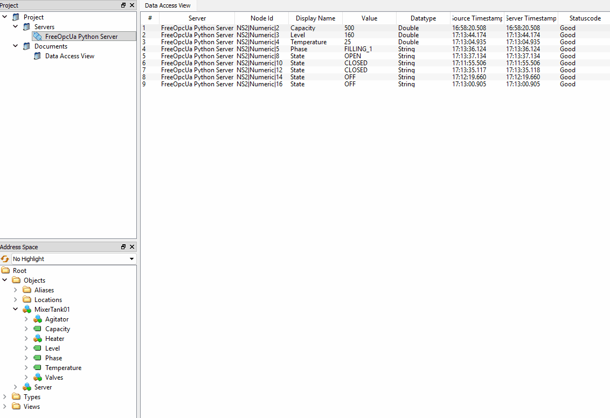

# Python OPC UA Server

**Industrial OPC UA server with PLC control logic and process simulation**

This project is a Python-based OPC UA server that simulates an industrial mixing tank and exposes its process data through an OPC UA interface.

The project combines a Python-based PLC control logic with a simulated mixing process, OPC UA communication using asyncua, and containerized deployment on a Raspberry Pi 4 using Docker.

## Technology Stack

## OPC UA Client

The OPC UA server can be connected to using an OPC UA client such as UAExpert.

